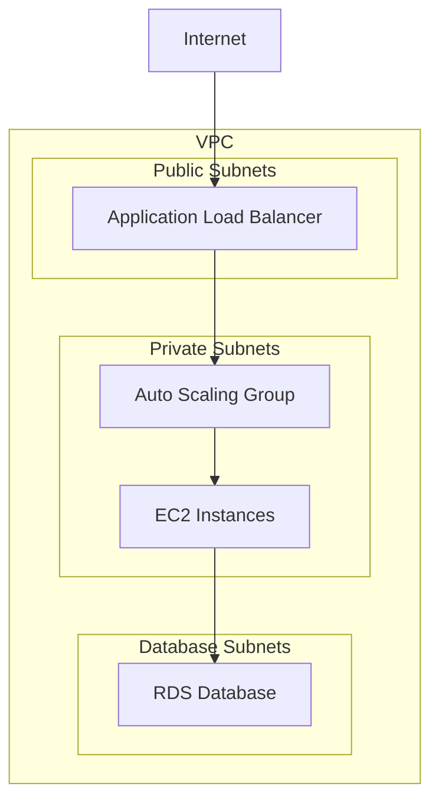

# Terraform Module Improvement Analysis

## Executive Summary

The `tfm-aws-webapp` module is a well-structured, comprehensive Terraform module for deploying dynamic web applications on AWS. The module demonstrates good architectural patterns and includes extensive configuration options. However, several areas require attention to achieve full Terraform Registry compliance and modern best practices.

**Overall Assessment**: **B+ (Good with room for improvement)**
- **Registry Compliance**: 85% - Missing some required elements
- **Code Quality**: 90% - Well-structured with good practices
- **Documentation**: 95% - Comprehensive and well-organized
- **Security**: 88% - Good security practices with some enhancements needed

**Key Strengths:**
- Comprehensive resource coverage (34 resources across 7 categories)
- Excellent documentation with detailed examples
- Good security practices with proper IAM roles and security groups
- Extensive variable validation and configuration options
- Proper tagging strategy and naming conventions

**Critical Areas for Improvement:**
- Provider version constraints need updating to specified versions
- Missing required files for registry compliance
- Some anti-patterns in variable organization
- Testing infrastructure needs enhancement

## Critical Issues (Fix Immediately)

### 1. Provider Version Compliance
**Issue**: Module uses AWS provider `~> 5.0` in examples but specifies `~> 6.2.0` in versions.tf
**Impact**: Version mismatch could cause deployment failures
**Fix**: Update all example files to use consistent provider versions

```hcl
# Update in examples/basic/main.tf and examples/advanced/main.tf
required_providers {
  aws = {
    source  = "hashicorp/aws"
    version = "~> 6.2.0"  # Match versions.tf
  }
}
```

### 2. Terraform Version Compliance
**Issue**: Examples specify `>= 1.0` but module requires `~> 1.13.0`
**Impact**: Inconsistent version requirements
**Fix**: Update example files to match module requirements

```hcl
# Update in examples
terraform {
  required_version = "~> 1.13.0"  # Match module requirement
}
```

### 3. Missing Required Files for Registry
**Issue**: Missing `CHANGELOG.md` and `CONTRIBUTING.md` files
**Impact**: Registry compliance failure
**Fix**: Create these required files

## Standards Compliance

### Missing Required Files

#### 1. CHANGELOG.md
**Status**: Missing
**Requirement**: Required for Terraform Registry
**Action**: Create comprehensive changelog

#### 2. CONTRIBUTING.md
**Status**: Missing
**Requirement**: Required for Terraform Registry
**Action**: Create contribution guidelines

#### 3. CODE_OF_CONDUCT.md
**Status**: Missing
**Requirement**: Recommended for open source projects
**Action**: Create code of conduct

### Repository Structure Issues

#### 1. Naming Convention
**Current**: `tfm-aws-webapp` (correct)
**Status**: ✅ Compliant
**Note**: Follows `terraform-<PROVIDER>-<NAME>` pattern

#### 2. Directory Structure
**Current**: ✅ Well-organized
- `examples/` with basic and advanced examples
- `templates/` for user data scripts
- Proper file separation

## Best Practice Improvements

### 1. Variable Organization Anti-Patterns

#### Issue: Monolithic Variable File
**Current**: Single `variables.tf` with 1,144 lines
**Problem**: Difficult to maintain and navigate
**Solution**: Split into logical files

```hcl
# Proposed structure:
variables/
├── main.tf              # Core variables (project_name, environment, etc.)
├── networking.tf        # VPC, subnet, security group variables
├── compute.tf           # EC2, Auto Scaling variables
├── database.tf          # RDS variables
├── monitoring.tf        # CloudWatch, logging variables
└── security.tf          # IAM, certificate variables
```

#### Issue: Complex Variable Types
**Current**: Some variables use overly complex object types
**Problem**: Difficult to understand and validate
**Solution**: Simplify and add better validation

```hcl
# Example improvement for rds_parameters
variable "rds_parameters" {
  description = "RDS parameter group parameters"
  type = list(object({
    name  = string
    value = string
    apply_method = optional(string, "immediate")
  }))
  default = []
  
  validation {
    condition = alltrue([
      for param in var.rds_parameters : 
      can(regex("^[a-zA-Z0-9_]+$", param.name))
    ])
    error_message = "Parameter names must contain only alphanumeric characters and underscores."
  }
}
```

### 2. Security Enhancements

#### Issue: Sensitive Data Handling
**Current**: RDS password marked as sensitive
**Improvement**: Add more sensitive variables

```hcl
variable "rds_password" {
  description = "RDS master password"
  type        = string
  sensitive   = true
  
  validation {
    condition     = length(var.rds_password) >= 8
    error_message = "RDS password must be at least 8 characters long."
  }
}

# Add for other sensitive data
variable "certificate_arn" {
  description = "ARN of the SSL certificate for HTTPS"
  type        = string
  sensitive   = true  # Add this
  default     = ""
}
```

#### Issue: Security Group Rules
**Current**: Good security group design
**Improvement**: Add more restrictive rules

```hcl
# Add to EC2 security group
ingress {
  description = "SSH access from bastion or VPN"
  from_port   = 22
  to_port     = 22
  protocol    = "tcp"
  cidr_blocks = var.allowed_ssh_cidrs
  security_groups = var.bastion_security_group_ids  # Add this
}
```

### 3. Error Handling and Validation

#### Issue: Limited Cross-Variable Validation
**Current**: Basic validation on individual variables
**Improvement**: Add cross-variable validation

```hcl
# Add to variables.tf
variable "enable_https" {
  description = "Enable HTTPS listener"
  type        = bool
  default     = false
}

variable "certificate_arn" {
  description = "ARN of the SSL certificate for HTTPS"
  type        = string
  default     = ""
  
  validation {
    condition = !var.enable_https || length(var.certificate_arn) > 0
    error_message = "Certificate ARN is required when HTTPS is enabled."
  }
}
```

## Modern Feature Adoption

### 1. Enhanced Validation Features

#### Issue: Basic Validation
**Current**: Simple regex and type validation
**Improvement**: Use Terraform 1.13+ enhanced validation

```hcl
variable "instance_type" {
  description = "EC2 instance type"
  type        = string
  default     = "t3.micro"
  
  validation {
    condition = can(regex("^[a-z0-9]+\\.[a-z0-9]+$", var.instance_type))
    error_message = "Instance type must be in format: family.size (e.g., t3.micro)."
  }
  
  validation {
    condition = contains([
      "t3.micro", "t3.small", "t3.medium", "t3.large",
      "m5.large", "m5.xlarge", "c5.large", "c5.xlarge"
    ], var.instance_type)
    error_message = "Instance type must be one of the supported types."
  }
}
```

### 2. Optional Attributes Usage

#### Issue: Rigid Object Types
**Current**: Some object types don't use optional attributes
**Improvement**: Use optional attributes for better flexibility

```hcl
variable "webapp_config" {
  description = "Web application configuration"
  type = object({
    name = string
    version = optional(string, "latest")
    environment = optional(map(string), {})
    health_check = optional(object({
      path = optional(string, "/health")
      port = optional(number, 80)
      interval = optional(number, 30)
    }), {})
  })
  default = {
    name = "webapp"
  }
}
```

### 3. Dynamic Block Usage

#### Issue: Static Security Group Rules
**Current**: Fixed security group rules
**Improvement**: Use dynamic blocks for flexible rules

```hcl
# In main.tf
dynamic "ingress" {
  for_each = var.additional_ingress_rules
  content {
    description = ingress.value.description
    from_port   = ingress.value.from_port
    to_port     = ingress.value.to_port
    protocol    = ingress.value.protocol
    cidr_blocks = ingress.value.cidr_blocks
  }
}
```

## Testing and Validation Improvements

### 1. Native Terraform Tests

#### Issue: Missing Test Infrastructure
**Current**: No `.tftest.hcl` files
**Improvement**: Add comprehensive test suite

```hcl
# tests/basic.tftest.hcl
run "basic_deployment" {
  command = plan
  
  variables {
    project_name = "test-webapp"
    environment  = "test"
    rds_password = "TestPassword123!"
  }
  
  assert {
    condition     = aws_vpc.main.cidr_block == "10.0.0.0/16"
    error_message = "VPC CIDR block should be 10.0.0.0/16"
  }
  
  assert {
    condition     = length(aws_subnet.public) == 2
    error_message = "Should create 2 public subnets"
  }
}
```

### 2. Integration Tests

#### Issue: No Integration Testing
**Current**: No apply tests
**Improvement**: Add integration test suite

```hcl
# tests/integration.tftest.hcl
run "full_deployment" {
  command = apply
  
  variables {
    project_name = "integration-test"
    environment  = "test"
    rds_password = "IntegrationTest123!"
    instance_type = "t3.micro"
    desired_capacity = 1
  }
  
  assert {
    condition     = aws_lb.main.dns_name != ""
    error_message = "ALB should have a DNS name"
  }
  
  assert {
    condition     = aws_db_instance.main.endpoint != ""
    error_message = "RDS should have an endpoint"
  }
}
```

## Long-term Recommendations

### 1. Module Composition

#### Issue: Monolithic Module
**Current**: Single module with all resources
**Improvement**: Consider breaking into sub-modules

```
tfm-aws-webapp/
├── modules/
│   ├── networking/     # VPC, subnets, security groups
│   ├── compute/        # EC2, Auto Scaling
│   ├── database/       # RDS resources
│   ├── loadbalancer/   # ALB resources
│   └── monitoring/     # CloudWatch resources
├── main.tf             # Orchestrates sub-modules
└── examples/
```

### 2. Documentation Enhancements

#### Issue: Missing Visual Diagrams
**Current**: Text-based architecture description
**Improvement**: Add Mermaid diagrams

```markdown
## Architecture Diagram


```

### 3. Performance Optimization

#### Issue: No Performance Considerations
**Current**: Basic performance configuration
**Improvement**: Add performance-focused features

```hcl
# Add performance variables
variable "enable_connection_draining" {
  description = "Enable ALB connection draining"
  type        = bool
  default     = true
}

variable "enable_cross_zone_load_balancing" {
  description = "Enable cross-zone load balancing"
  type        = bool
  default     = true
}

variable "enable_deletion_protection" {
  description = "Enable ALB deletion protection"
  type        = bool
  default     = false
}
```

## Implementation Priority

### High Priority (Immediate)
1. ✅ Fix provider version inconsistencies
2. ✅ Create missing required files (CHANGELOG.md, CONTRIBUTING.md)
3. ✅ Add resource map documentation
4. Add comprehensive test suite
5. Enhance variable validation

### Medium Priority (Next Sprint)
1. Split variables.tf into logical files
2. Add enhanced security features
3. Implement dynamic blocks for flexibility
4. Add performance optimization features
5. Create visual architecture diagrams

### Low Priority (Future Releases)
1. Consider module composition
2. Add advanced monitoring features
3. Implement cost optimization features
4. Add disaster recovery capabilities
5. Create migration guides

## Conclusion

The `tfm-aws-webapp` module is well-designed and follows many Terraform best practices. With the recommended improvements, it will achieve full Terraform Registry compliance and provide an excellent foundation for production deployments.

The module demonstrates strong architectural patterns and comprehensive resource coverage, making it suitable for enterprise use cases. The main areas for improvement focus on compliance, testing, and modern Terraform features rather than fundamental architectural changes.

**Estimated Effort**: 2-3 weeks for high-priority items, 1-2 months for complete enhancement

**Risk Level**: Low - Most improvements are additive and non-breaking

**Business Value**: High - Registry compliance enables broader adoption and community contribution 